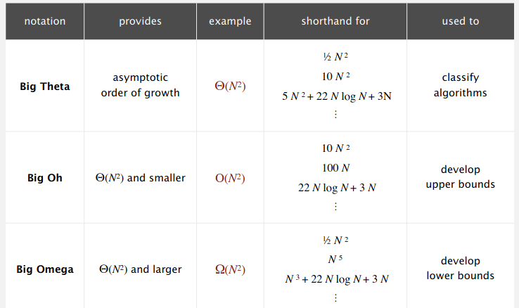

# 1 Example: ThreeSum Problem
Given N distinct integers, how many triples sum to exactly 0?

brute-force algorithm: [Three-tier loop](Exercises/1.4%20Analysis%20of%20Algorithms/ThreeSum.cpp)
```
$ ./ThreeSum 2Kints.txt
```

# 2 Mathematic Model
## 2.1 Sometimes tedious to count exactly
- OneSum Problem
  
  

- TwoSum Problem
  
  

## 2.2 Simplification
1. Cost model: Use some basic operation (most expensive / most often) operation as a proxy for running time
2. Tilde notation $\sim$: Ignore lower order terms

## 2.3 Return to Problems
1. TwoSum: Array access $2 \times \sum_{i=1}^N\sum_{j=i}^N1\sim N^2$
2. ThreeSum: Array access $3\times\sum_{i=1}^N\sum_{j=i}^N\sum_{k=j}^N1\sim \frac{1}{2}N^3$

## 2.4 Estimating a discrete sum
Replace the sum with an intergral and use calculus!

$$\sum_{i=1}^N\sum_{j=i}^N\sum_{k=j}^N1\sim\int_{x=1}^N\int_{y=x}^N\int_{z=y}^N1dzdydx\sim$$

# 3 Orders of growth classifications


We need at least linear or linearithmic algorithms.

## 3.1 Binary search ($\log N$)
Given a sorted array and a key, find index of the key in the array.

[BinarySearch.cpp](Exercises/1.4%20Analysis%20of%20Algorithms/BInarySearch.cpp)

Binary Search uses at most $\log N+1$ compares for a sorted array of size N.

- Provement:
  
  1. Define $T(N)$ as the amount of compares we need to binary search in a sorted array of size N
  2. $T(N)\leq T(N/2) + 1,\ \text{for } N>1, with T(1)=1$. We only need to consider half of the array after first compare!
  3. $T(N)\leq T(N/2) + 1\leq T(N/4) + 2\leq T(N/N) + \log N=1+ \log N$

## 3.2 Sorting-based algorithm for ThreeSum ($N^2\log N$)
- Sort the N distinct numbers
- For each pair of numbers `a[i]` and `a[j]`, find `-(a[i]+a[j])`

[ThreeSumDeluxe.cpp](Exercises/1.4%20Analysis%20of%20Algorithms/ThreeSumDeluxe.cpp)

# 4 Theory of Algorithms
## 4.1 Types of analyses
- Best case
- Worst case
- Average case



Upper bound is for algorithm, but lower bound is for the problem. When there is no gap between upper bound and lower bound, we say this algorithm is optimal. Otherwise, we are not sure whether this algorithm is optimal for this problem.
## 4.2 Examples
### 4.2.1 OneSum, Brute-force algorithm
- Upper bound: look at every array entry: $O(N)$
- Lower bound: Have to examine all N entries, any unexamined one might be 0: $\Omega(N)$
- Optimal algorithm: Lower bound equals to upper bound, Brute-force algorithm is optimal: $\Theta(N)$

### 4.2.2 ThreeSum, Sorting-based algorithm
- Upper bound: $O(N^2\log N)$
- Lower bound: Have to examine all N entries to solve ThreeSum
- Open problems: Is sorting-based algorithm optimal?

# 5 Memory
## 5.1 Typical Memory


