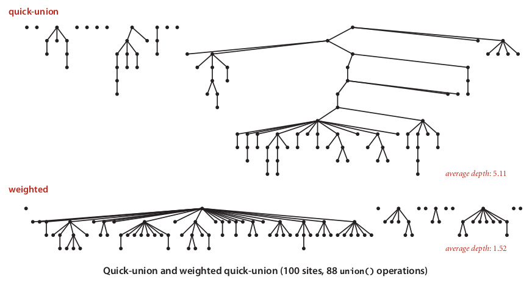

# 1 Dynamic Connectivity
## 1.1 Problem description
Given a set of N objects, we need to implement two commands:
- Union command: connect two objects
- Find/Connected query: Is there a path connecting the two objects?

## 1.2 Modeling the connections
1. We assume that **“is connected to”** is an equivalence relation, which means that it is
   - Reflexive : `p` is connected to `p`.
   - Symmetric : If `p` is connected to `q` , then `q` is connected to `p`.
   - Transitive : If `p` is connected to `q` and `q` is connected to `r` , then `p` is connected to `r`.
  
2. We assume **Connected components** as maximal set of objects that are mutually connected. Any Element of one connected component is **not** connected to elements of other connected components

3. Implementing the operations:
   - Union command: replace components containing two objects with their union (Merge!)
   - Find query: Check if two objwcts are in the same component

4. Goal: Design efficient data structure for union-find

# 2 Quick find (eager approach)
## 2.1 Data structure
- Use integer array `id[]` of size N.
- Interpretation: `id[i]` means the component object `i` belongs to. 
- Find: `p` and `q` are connected if and only if they have the same id.
- Union: Change `id` of all objects with `id[p]` to `id[q]`

## 2.2 Implementation

```cpp
class UF{
public:
    UF(int N) : id(N, 0){
        for (int i = 0; i != N; ++i)
            id[i] = i;
    }
    bool connected(int p, int q) {
        return (id[p] == id[q]);
    }
    // use `connect` instead of `union` because `union` is a C++ keyword
    void connect(int p, int q) {
        int pid = id[p];
        int qid = id[q];
        for (int i = 0; i != id.size(); ++i) {
            if (id[i] == pid)
                id[i] = qid;
        }
    }

private:
    std::vector<int> id;
};
```

## 2.3 Efficiency of Quick Find
- Initialize: N (tranverse the array one time)
- Union: N (tranverse the array one time)
- Find: 1

Too slow

# 3 Quick union (lazy approach)
## 3.1 Data structure
- Use integer array `id[]` of size N.
- Interpretation: `id[i]` is parent of `i`, parent of unconnected object is itself
- Root of `i` is `id[id[id[...id[i]...]]]` (like a tree)
- Find: `p` and `q` are connected if and only if they have the same root.
- Union: Set `id` of `p`'s root to the id of `q`'s root

## 3.2 Implementation
```cpp
class QuickUnionUF{
public:
    QuickUnionUF(int N) : id(N, 0) {
        for (int i = 0; i != N; ++i)
            id[i] = i;
    }

    bool connected(int p, int q) {
        return (root(p) == root(q));
    }
    // Union
    void connect(int p, int q) {
        id[root(p)] = root(q);
    }

private:
    std::vector<int> id;
    int root(int i) {
        while (id[i] != i)
            i = id[i];
        return i;
    }
};
```
## 3.3 Efficiency of Quick Union
Worst case:
- Initialize: N (tranverse the array one time)
- Union: N (includes cost of finding roots, in which we may need to tranverse the array one time. Assuming we have only two components and we wang to connect two leaf nodes)
- Find: N (includes cost of finding roots)

even slower, but can be improved

# 4 Weighted quick union
## 4.1 Improvements
- Modify quick union to avoid tall trees
- Keep track of size of each tree (number of objects)
- Balance by linking root of smaller tree to root of larger tree instead of linking to a node of larger tree. 



## 4.2 Data structure
- Use integer array `id[]` of size N.
- Interpretation: `id[i]` is parent of `i`, parent of unconnected object is itself
- Root of `i` is `id[id[id[...id[i]...]]]` (like a tree)
- Find: `p` and `q` are connected if and only if they have the same root.
- Union: link smaller tree to the root of larger tree

## 4.3 Implementation
```cpp
class WeightedQuickUnionUF {
public:
    WeightedQuickUnionUF(int N) : id(N, 0), sz(N, 1) {
        for (int i = 0; i != N; ++i) {
            id[i] = i;
        }
    }

    bool connected(int p, int q) {
        return (root(p) == root(q));
    }
    // Union
    void connect(int p, int q) {
        int i = root(p);
        int j = root(q);
        if (i == j)
            return;
        if (sz[i] < sz[j]) {
            id[i] = j;
            // Only sz[root] matters
            sz[j] += sz[i];
        }
        else {
            id[j] = i;
            sz[i] += sz[j];
        }
    }

private:
    std::vector<int> id;
    std::vector<int> sz;
    int root(int i) {
        while (id[i] != i)
            i = id[i];
        return i;
    }
};
```

## 4.4 Efficiency of Weighted Quick Union
Depth of any node is at most logN, because smaller tree will be linked to the root to larger tree.
- Initialize: N (tranverse the array one time)
- Union: logN 
- Find: logN

But we still want to improve further.

# 5 Quick Union with path compression
## 5.1 Improvements
Keep tree almost completely flat by setting `id` of each examined node to that root after computing the root.

## 5.2 Implementation
```cpp
class CompressedQuickUnionUF {
public:
    CompressedQuickUnionUF(int N) : id(N, 0), sz(N, 1) {
        for (int i = 0; i != N; ++i) {
            id[i] = i;
        }
    }

    bool connected(int p, int q) {
        return (root(p) == root(q));
    }
    // Union
    void connect(int p, int q) {
        int i = root(p);
        int j = root(q);
        if (i == j)
            return;
        if (sz[i] < sz[j]) {
            id[i] = j;
            // Only sz[root] matters
            sz[j] += sz[i];
        }
        else {
            id[j] = i;
            sz[i] += sz[j];
        }
    }

private:
    std::vector<int> id;
    std::vector<int> sz;
    int root(int i) {
        while (id[i] != i) {
            id[i] = id[id[i]]; //Only one extra line of code!
            i = id[i];
        }
        return i;
    }
};
```

## 5.3 Efficiency of weighted Quick Union with Path compression
- Initialize: N (tranverse the array one time)
- Union: nearly, but not quite 1
- Find: nearly, but not quite 1

# 6 Application: Percolation
We have a N-by-N grid of sites. Each site is open with probability p or blocked with probability 1-p. System **percolates** if and only if top and bottom are connected by open sites.


See [1_5.cpp](Exercises/1.5%20Union%20Find/1_5.cpp) for more
